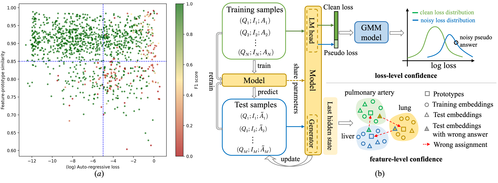

# DuCoR: Dual-Level Confidence Self-Refinement for Medical VQA

Medical visual question answering models often face potential train-test distribution shifts that hinder generalization across unseen imaging and linguistic patterns. To address this challenge, we propose a dual-level confidence based framework (DuCoR) that achieves implicit self-refinement through iterative pseudo-supervised optimization. Instead of relying on fixed pseudo answers, the model progressively refines its predictions by estimating their reliability from two complementary perspectives. A loss-level confidence captures the reliability of supervision by modeling clean and noisy loss distributions, while a feature-level confidence measures the semantic coherence between sample representations and their pseudo-answer conditioned prototypes. Since these two confidences originate from distinct information sources, including the supervision signal and the input semantics, they provide mutually corrective cues. They are adaptively fused to derive per-sample reliability weights that guide pseudo-supervised optimization toward better alignment with the target distribution. Extensive experiments on multiple medical VQA benchmarks show that our method achieves superior performance and exhibits improved cross-domain generalization over fully supervised baseline.




## Runtime Environment

Python: `3.9.23`

Key packages:
`torch==2.5.1`, `torchvision==0.15.2a0`, `torchaudio==2.5.1`, `transformers==4.49.0`, `accelerate==1.9.0`, `deepspeed==0.16.7`, `peft==0.15.2`, `timm==1.0.19`, `sentencepiece==0.2.0`, `numpy==1.26.4`, `scipy==1.13.1`, `scikit-learn==1.6.1`, `Pillow==11.1.0`, `opencv-python==4.10.0`, `pandas==2.2.3`, `matplotlib==3.9.2`, `tokenizers==0.21.4.dev0`, `safetensors==0.5.3`, `nltk==3.9.1`, `tqdm==4.67.1`, `bert-score==0.3.9`, `requests==2.32.4`.


## Datasets

Pretraining data:

- Download the medical alignment/instruction data from [LLaVA-Med](https://github.com/microsoft/LLaVA-Med)

- Run `down_image.py` to download PMC images, and set the local paths with --pretrain_data_path and --pretrain_image_root.


Medical VQA benchmarks:

- [VQA-RAD](https://www.nature.com/articles/sdata2018251)
- [SLAKE](https://arxiv.org/abs/2102.09542)
- [PathVQA](https://arxiv.org/abs/2003.10286)

Place all datasets under the `data/` folder.

## Model Training

The training pipeline consists of four stages: pretraining, medical instruction supervised fine-tuning, baseline fine-tuning, and DuCoR training.

**1. Pretraining**

Perform domain alignment using biomedical image-text pairs from LLaVA-Med/PMC-15M-style annotations. This stage trains the visual encoder, projector, and language model adapters to better align visual representations with biomedical language descriptions.

```bash
bash scripts/run_pretrain.sh
```

**2. Medical Instruction SFT**

Conduct medical instruction supervised fine-tuning using LLaVA-Med-style multimodal medical instruction conversations. The model is initialized from the pretraining checkpoint and uses the same prompt format as the downstream medical VQA tasks.

```bash
bash scripts/run_sft.sh
```

**3. Baseline Fine-tuning**

The baseline model is fine-tuned on labeled medical VQA datasets using the standard autoregressive answer loss. The model is initialized from the medical instruction SFT checkpoint.

```bash
python run_baseline.py
```

**4. DuCoR Training**

DuCoR starts from the baseline checkpoint. It first loads the pseudo answers generated by the baseline model, estimates the reliability of each sample, and then iteratively refines the model with confidence-weighted pseudo supervision.

```bash
python run_ducor.py
```

## Acknowledgements

This project uses data from the following open-source project:

* [LLaVA-Med](https://github.com/microsoft/LLaVA-Med)


